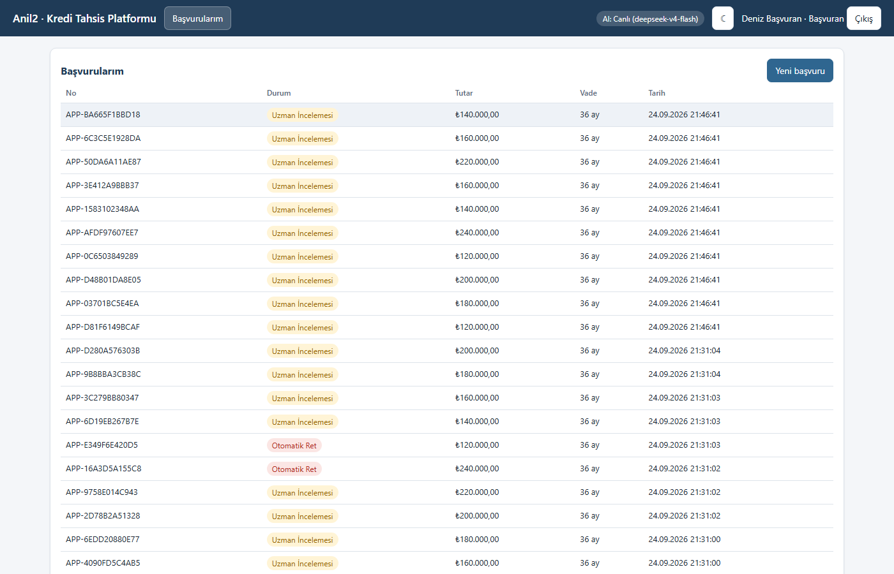
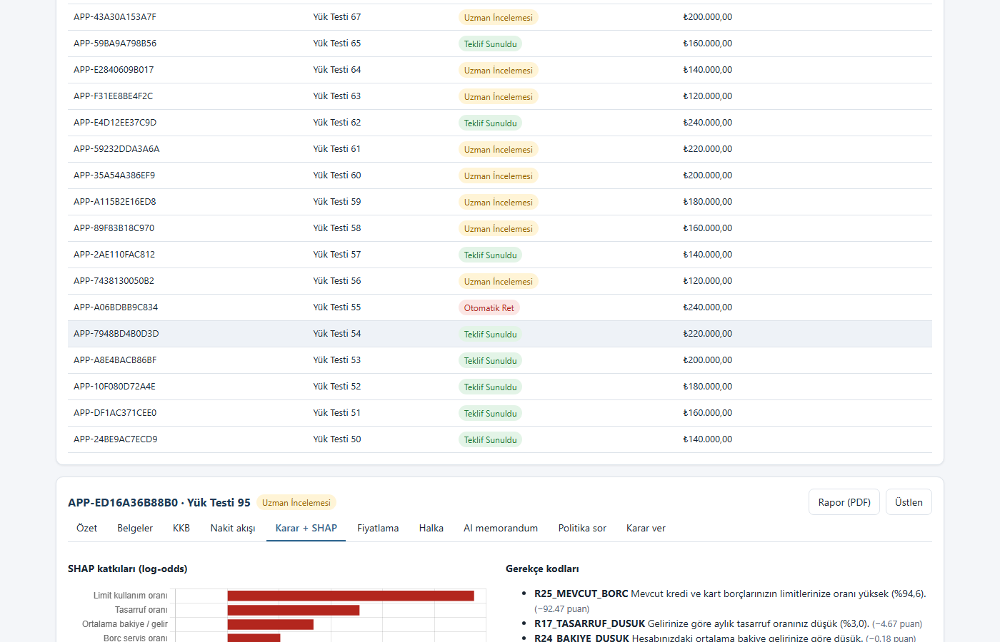
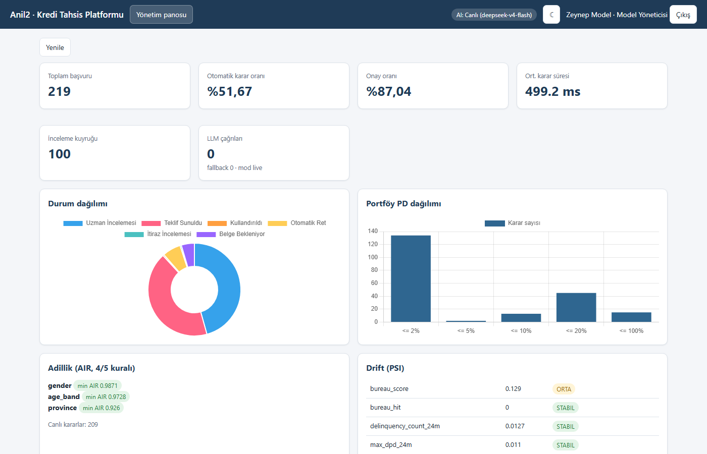
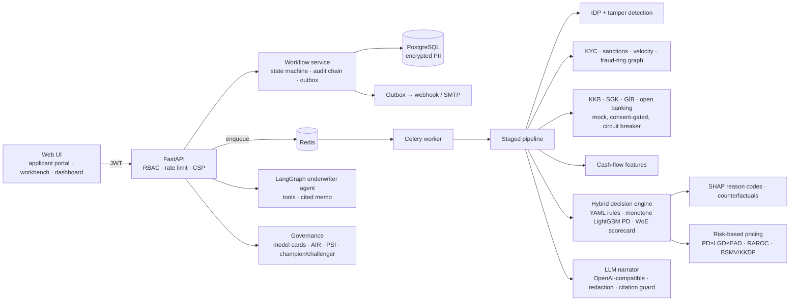

# Anil2 — Explainable Hybrid Credit Origination Platform

[](https://github.com/tunadeniz1304/Anil2/actions/workflows/ci.yml)
  

> **Human-in-the-loop, explainable hybrid credit decisioning designed with the BDDK credit allocation guidance and KVKK art. 11 in mind. Because the LLM layer is OpenAI-compatible, it can be moved to an on-premise model (vLLM/Ollama) with a one-line setting to support BDDK data-localisation requirements; designed with the EU AI Act high-risk requirements in mind. The methodology is validated on real public credit data; Turkish data is synthetic (see Limitations).**

Anil2 takes a retail loan application end to end — application → KYC → document processing → data enrichment → decision engine → pricing → authority matrix → offer/contract → disbursal — and explains every step. The binding decision always comes from a deterministic, replayable engine and authorised people. The LLM only explains, summarises and recommends.

## Run it in 30 seconds

```bash
docker compose up --build          # postgres, redis, app, worker, beat, mailhog
open http://localhost:8000         # web UI (log in as admin → "Load demo scenario")
python scripts/smoke.py            # end-to-end HTTP smoke test (19 steps)
```

Local development without Docker (SQLite + inline worker, no Redis required):

```bash
pip install -r requirements.txt
uvicorn app.main:app --reload       # models are already in artifacts/models
python -m pytest -q --cov=app       # 231 tests, 89% coverage
```

**Demo users** (password `Demo123!`, dev only): `basvuran`, `basvuran2` (applicants) · `uzman`, `uzman2` (credit specialists) · `kidemli` (senior specialist) · `komite` (credit committee) · `modelyon`, `modelyon2` (model managers) · `admin`.

## LLM modes

| Situation | Mode | Behaviour |
|---|---|---|
| `LLM_API_KEY` (or `DEEPSEEK_API_KEY` / `GATEWAY_API_KEY` / `OPENAI_API_KEY`) present in `.env` or `../.env` | **live** | any OpenAI-compatible endpoint (`LLM_BASE_URL`, default `https://api.deepseek.com`; `LLM_MODEL`), startup log `LLM: CANLI (<model> @ <host>)` |
| No key | **demo** | Deterministic, professional Turkish memos, committee summaries and letters generated from the same decision context |
| A live call fails (timeout, 429, 5xx, invalid JSON, citation violation) | **fallback** | One repair attempt, then the demo output for *that call only*; flagged `llm_mode=fallback` + `llm_error_kind`; an application never fails because of the LLM |

* `python scripts/llm_smoke.py` → `OK model=… latency=…ms` or `DEMO modu`.
* Every number in an LLM narrative must cite a decision-context field (`[f:dsr]`), otherwise it is rejected.
* PII (name, TCKN, phone, IBAN, address, e-mail) is pseudonymised before leaving the process and restored in the response; logs are masked.
* On-premise model: `LLM_BASE_URL=http://vllm:8000/v1 LLM_MODEL=qwen2.5-32b-instruct` — nothing else changes.

## Screenshots

| Applicant portal | Underwriter workbench (SHAP + reason codes) | Management dashboard |
|---|---|---|
|  |  |  |

## Architecture



### Application state machine

```mermaid
stateDiagram-v2
  [*] --> TASLAK
  TASLAK --> GONDERILDI
  GONDERILDI --> BELGE_BEKLENIYOR: documents missing
  GONDERILDI --> BELGE_INCELEMEDE
  BELGE_BEKLENIYOR --> BELGE_INCELEMEDE: upload completed
  BELGE_INCELEMEDE --> VERI_TOPLANIYOR
  VERI_TOPLANIYOR --> KARAR_MOTORU: KKB/SGK/open banking ok (retry on outage)
  KARAR_MOTORU --> OTOMATIK_ONAY
  KARAR_MOTORU --> OTOMATIK_RET
  KARAR_MOTORU --> UZMAN_INCELEMESI
  OTOMATIK_ONAY --> TEKLIF_SUNULDU
  UZMAN_INCELEMESI --> TEKLIF_SUNULDU: authority matrix + four-eyes
  UZMAN_INCELEMESI --> REDDEDILDI
  UZMAN_INCELEMESI --> BELGE_BEKLENIYOR: more documents
  OTOMATIK_RET --> ITIRAZ_INCELEMESI: KVKK art. 11
  REDDEDILDI --> ITIRAZ_INCELEMESI
  ITIRAZ_INCELEMESI --> UZMAN_INCELEMESI: objection upheld
  ITIRAZ_INCELEMESI --> REDDEDILDI
  TEKLIF_SUNULDU --> TEKLIF_KABUL --> SOZLESME_HAZIR --> KULLANDIRILDI
  TEKLIF_SUNULDU --> IPTAL
```

See [`docs/ARCHITECTURE.md`](docs/ARCHITECTURE.md) and the [ADRs](docs/adr/).

## Inspired-by patterns

These are the industry patterns the design borrows; Anil2 is a portfolio-scale implementation of the
ideas, **not** a peer of these products.

| Pattern (where it comes from) | How Anil2 implements a small version of it |
|---|---|
| Loan-origination state machine (LOS vendors) | Explicit state machine, document gate, authority matrix, offer, contract, disbursal |
| Rules + ML hybrid decisioning | Versioned YAML policy DSL (safe evaluator) + monotone LightGBM PD (isotonic) + WoE scorecard + shadow challenger |
| Applicant-specific adverse-action reasons (ECOA/Reg B practice) | SHAP → material, value-conditioned Turkish reason codes + counterfactuals |
| Less-discriminatory-alternative search (fair-lending practice) | fairlearn metrics, AIR, equalised odds, LDA table at one approval rate |
| Document tamper checks (IDP products) | Producer-independent metadata, font, white-out, arithmetic and e-Devlet barcode signals; OCR via Tesseract |
| Cash-flow underwriting (open banking) | 24 transaction features (income volatility, NSF, gambling share, savings rate …) |
| Risk-based pricing | PD×LGD×EAD, Basel IRB other-retail capital, RAROC-solved rate, BSMV/KKDF, legal cap, APR, DSR re-check after pricing |
| Model risk management (SR 26-2) | Inventory, model cards, real-data validation, PSI drift, evidence-gated champion/challenger with four-eyes |

## Limitations

* **No real integrations.** KKB/Findeks, e-Devlet, SGK, GİB and open banking (GEÇİT) are mocks.
* **Turkish data is synthetic.** The production model runs on Turkey-specific synthetic features. Its
  methodology, the bureau behaviour sub-score and the calibration level are validated on **real public
  data** (UCI Taiwan, German Credit — `docs/VALIDATION_REPORT.md`), which is neither Turkish nor the same
  target (card default vs. 90+ DPD). A real bank portfolio is required for re-training and independent
  validation.
* **Fairness is not solved.** On German Credit the champion fails the four-fifths rule for age band and
  no alternative within the allowed AUC loss fixes it (open finding).
* **Single-process limits.** Local/inline mode uses SQLite with one writer at a time; scale-out needs
  the Docker topology (PostgreSQL + Celery). The 20-application concurrency test is a functional check,
  not a capacity figure.
* **Performance figures** are from one Windows laptop (`docs/PERFORMANCE.md`).
* **Regulation.** Designed with BDDK, KVKK, EU AI Act and SR 26-2 requirements in mind — not certified
  or audited as compliant (`docs/COMPLIANCE.md`, sources verified 2026-09-25).
* **OCR** needs Tesseract with the Turkish model (in the Docker image); without it scans go to a
  specialist.

## Demo scenarios (six personas)

Log in as `admin` → dashboard → **"Demo senaryosu yükle"** (or `python scripts/seed_demo.py`).

| # | Persona | What happens |
|---|---|---|
| 1 | Clean salaried | Automatic approval, risk-based offer, schedule with taxes |
| 2 | Thin file + good cash flow | No bureau record — approved thanks to open-banking cash flow |
| 3 | High DSR | Conditional counter-offer at the DSR cap + counterfactual ("reduce to … TL or extend to … months") |
| 4 | Tampered payslip | Incremental save, editing-tool producer, foreign font, broken arithmetic → fraud flag → specialist |
| 5 | Shared phone/IBAN ring | Third applicant sharing identifiers → fraud-ring review with graph |
| 6 | Grey zone | Specialist review, AI credit memorandum, pending four-eyes approval |

Walkthrough script: [`docs/DEMO_SCRIPT.md`](docs/DEMO_SCRIPT.md).

## Model evidence

**Real public data (lane A, UCI Taiwan, stratified 20 % hold-out, n = 6,000):**

| Model | AUC [95 % bootstrap CI] | Brier | Low-risk deciles obs/pred |
|---|---|---|---|
| **Monotone LightGBM + isotonic** (champion by evidence) | 0.779 [0.765, 0.792] | 0.1351 | 1.036 |
| WoE scorecard | 0.767 [0.752, 0.781] | 0.1370 | 0.96 |
| Logistic regression | 0.758 [0.743, 0.773] | 0.1402 | 0.987 |

LightGBM beats the scorecard by ΔAUC +0.0121 (DeLong p = 5.1e-05) and
logistic regression by +0.0209 (p = 4.4e-07); on the 1,000-row German set the
simpler scorecard wins. Full report: [`docs/VALIDATION_REPORT.md`](docs/VALIDATION_REPORT.md).

**Production model on the anchored synthetic population** (time-based test set, n = 16,803):
pd_lgbm_v2 AUC 0.827, scorecard_woe_v2 0.823, challenger_lr_v2 0.825 — these
synthetic numbers are not evidence of real-world performance. See [`docs/MODEL_CARD.md`](docs/MODEL_CARD.md),
[`docs/FAIRNESS_REPORT.md`](docs/FAIRNESS_REPORT.md) and [`docs/DATA.md`](docs/DATA.md).


## Main API

| Area | Endpoints |
|---|---|
| Auth | `POST /api/v1/auth/login`, `/register`, `GET /me` |
| Applications | `POST/GET /api/v1/applications`, `GET /{id}`, `/timeline`, `/decision`, `/offer`, `/schedule`, `/cashflow`, `/network`, `/audit`, `/report?format=pdf\|json`, `/contract`; `POST /{id}/documents`, `/consents/open-banking`, `/offer/accept`, `/objection`, `/cancel`, `/reprocess` |
| Workbench | `GET /api/v1/workbench/queue`, `/reviews`, `/objections`; `POST /{id}/assign`, `/decision`, `/fields/{field}`, `/objection/resolve`, `/disburse`, `/reviews/{id}/check` |
| Decisioning | `POST /api/v1/decisions/{id}/replay`, `POST /api/v1/pricing/quote` |
| AI | `POST/GET /api/v1/agent/{id}/memo`, `POST /api/v1/policy/ask`, `GET /api/v1/llm/status` |
| Governance | `GET /api/v1/models`, `/models/{id}/card?format=json\|md\|pdf`, `POST /models/{id}/promote`, `GET /api/v1/governance/{drift,fairness,champion-challenger}`, `/api/v1/rule-sets` (+ `/backtest`, `/{v}/approve`), `GET /api/v1/portfolio/watchlist` |
| Ops | `/health`, `/health/live`, `/health/ready`, `/metrics` (Prometheus), `GET /api/v1/metrics`, `/api/v1/queue`, `/api/v1/audit/verify`, `/api/v1/notifications` |

Interactive docs: `http://localhost:8000/docs`.

## Quality gates

`ruff check .` · `ruff format --check .` · `mypy app` (clean) · `pytest --cov=app` (231 tests, 89 %) · `docker compose build` — all enforced in [CI](.github/workflows/ci.yml).

## Documentation

[Architecture](docs/ARCHITECTURE.md) · [ADRs](docs/adr/) · [Model card](docs/MODEL_CARD.md) · [Fairness report](docs/FAIRNESS_REPORT.md) · [Compliance](docs/COMPLIANCE.md) · [Performance](docs/PERFORMANCE.md) · [Demo script](docs/DEMO_SCRIPT.md) · [Plan](docs/PLAN.md) · [Final report](docs/FINAL_REPORT.md) · [Changelog](CHANGELOG.md)

---

## Türkçe özet

Anil2; başvurudan kullandırıma kadar uçtan uca, açıklanabilir ve insan denetimli bir bireysel kredi tahsis platformudur. KYC ve dolandırıcılık ön kontrolleri, akıllı belge işleme ve sahtecilik tespiti, açık bankacılık nakit akışı analizi, versiyonlu politika kuralları + monotonik LightGBM PD modeli + WoE skor kartından oluşan hibrit karar motoru, SHAP tabanlı Türkçe gerekçe kodları ve "ne değişirse onaylanırsınız" önerileri, risk bazlı fiyatlama (PD×LGD×EAD, RAROC, BSMV/KKDF, yasal tavan), yetki matrisi ve dört göz onaylı krediler uzmanı çalışma masası, KVKK m.11 itiraz akışı, kaynak atıflı kredi memorandumu yazan denetimli ajan ve model risk yönetimi (model kartı, adillik, drift, champion/challenger) içerir. **Bağlayıcı kararı LLM vermez**; LLM yalnızca açıklar ve özetler. Anahtar varsa canlı DeepSeek, yoksa profesyonel Türkçe demo çıktıları üretilir. `docker compose up --build` ile tek komutla ayağa kalkar.

## License

[MIT](LICENSE)
