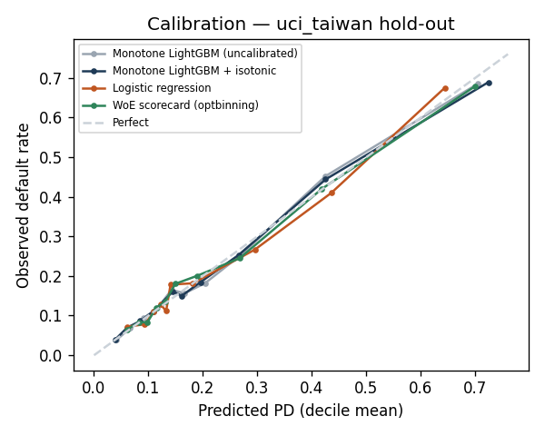
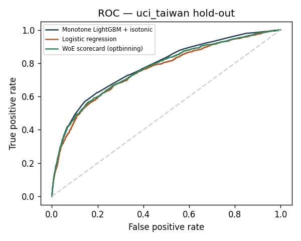
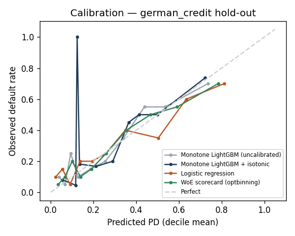
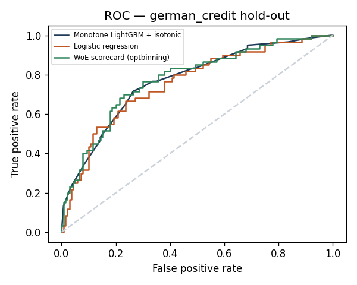

# Validation Report — methodology on real public credit data

Generated by `scripts/run_validation.py` from `artifacts/validation/<set>/metrics.json` (parameters: `rules/validation.yaml`). Data provenance, licences and checksums: [`docs/DATA.md`](DATA.md).

**What this shows.** The production modelling recipe — monotone LightGBM with isotonic calibration, logistic regression, optbinning WoE scorecard, SHAP, fairness and LDA search — run unchanged on real, labelled default data with each set's own variables. **What it does not show.** The production model's Turkish features (KKB score, DSR, open-banking cash flow) are synthetic; its numbers on synthetic data are not evidence of real-world performance.

## Summary

| Dataset | Champion | Champion AUC [95% CI] | LightGBM vs LR (ΔAUC, DeLong p) | Low-risk obs/pred | Worst AIR at 70% approval |
|---|---|---|---|---|---|
| uci_taiwan | Monotone LightGBM + isotonic | 0.7790 [0.765, 0.792] | +0.0209, p=4.39e-07 | 1.036 | 0.878 (EDUCATION) |
| german_credit | WoE scorecard (optbinning) | 0.7788 [0.707, 0.847] | +0.0120, p=0.571 | 1.748 | 0.698 (AGE_BAND) |

- **Alert — german_credit:** the champion fails the four-fifths rule for `AGE_BAND` (min AIR 0.698); no less discriminatory alternative stays within the allowed AUC loss, so the finding goes to the model risk committee (see the LDA table).
- **Alert — german_credit:** low-risk deciles observed/predicted = 1.748 (under-estimation of risk where approvals concentrate).

## UCI Default of Credit Card Clients (Taiwan, 30,000 rows)

Rows 30,000 · default rate 22.12% · train 24,000 (5-fold stratified CV) · stratified hold-out 6,000 (20%) · seed 20260925 · 23 own features.

- SEX, AGE, EDUCATION and MARRIAGE are not model inputs; they are used only for fairness.
- No time axis: stratified 5-fold CV on the training part plus a 20 % stratified hold-out.
- `PAY_0` is the September 2005 repayment status, the month before the target month (see DATA.md) — no same-month leakage.

### Cross-validation (training part)

| Model | Mean AUC | Std | Fold AUCs |
|---|---|---|---|
| Monotone LightGBM + isotonic | 0.7853 | 0.0054 | 0.7829, 0.7866, 0.7778, 0.7925, 0.7867 |
| Logistic regression | 0.7570 | 0.0060 | 0.759, 0.7542, 0.7498, 0.7659, 0.7559 |
| WoE scorecard (optbinning) | 0.7711 | 0.0059 | 0.7691, 0.7708, 0.7644, 0.7805, 0.7707 |

### Hold-out discrimination

| Model | AUC | 95% CI (bootstrap) | 95% CI (DeLong) | Gini | KS | Brier | Log loss |
|---|---|---|---|---|---|---|---|
| Monotone LightGBM + isotonic | 0.7790 | [0.765, 0.792] | [0.764, 0.794] | 0.5580 | 0.4335 | 0.1351 | 0.4297 |
| Logistic regression | 0.7581 | [0.743, 0.773] | [0.743, 0.774] | 0.5162 | 0.3995 | 0.1402 | 0.4451 |
| WoE scorecard (optbinning) | 0.7669 | [0.752, 0.781] | [0.752, 0.782] | 0.5338 | 0.4076 | 0.1370 | 0.4368 |

DeLong tests on the hold-out (two-sided):

| Comparison | ΔAUC | 95% CI of Δ | z | p-value |
|---|---|---|---|---|
| Monotone LightGBM + isotonic vs Logistic regression | +0.0209 | [0.013, 0.029] | 5.05 | 4.39e-07 |
| Monotone LightGBM + isotonic vs WoE scorecard (optbinning) | +0.0121 | [0.006, 0.018] | 4.05 | 5.05e-05 |
| Logistic regression vs WoE scorecard (optbinning) | -0.0088 | [-0.015, -0.003] | -2.85 | 0.00438 |

**Champion: Monotone LightGBM + isotonic.** Rule: a more complex model replaces a simpler one only when the DeLong test is significant *and* the AUC gain is material (thresholds in `rules/validation.yaml`).

- Logistic regression vs WoE scorecard (optbinning): ΔAUC -0.0088, DeLong p = 0.00438 → significantly worse — simpler model kept
- Monotone LightGBM + isotonic vs WoE scorecard (optbinning): ΔAUC +0.0121, DeLong p = 5.05e-05 → selected
- Thresholds: α = 0.05, minimum ΔAUC = 0.005.

### Calibration (hold-out)

| Model | Mean PD | Observed | ECE | Hosmer–Lemeshow χ² (p) | Low-risk deciles: predicted → observed (ratio) |
|---|---|---|---|---|---|
| Monotone LightGBM (uncalibrated) | 22.3% | 22.1% | 0.0128 | 8.8 (0.364) | 6.6% → 6.7% (1.01) |
| Monotone LightGBM + isotonic | 22.2% | 22.1% | 0.0097 | 6.0 (0.642) | 6.4% → 6.6% (1.036) |
| Logistic regression | 22.2% | 22.1% | 0.0177 | 19.1 (0.0145) | 8.8% → 8.7% (0.987) |
| WoE scorecard (optbinning) | 22.1% | 22.1% | 0.0117 | 10.2 (0.254) | 8.0% → 7.7% (0.96) |

Decile table of the champion (Monotone LightGBM + isotonic):

| Decile | n | PD range | Predicted | Observed | Obs / pred |
|---|---|---|---|---|---|
| 1 | 600 | 0.001–0.059 | 3.9% | 3.8% | 0.988 |
| 2 | 600 | 0.059–0.082 | 6.5% | 7.3% | 1.129 |
| 3 | 600 | 0.082–0.093 | 8.8% | 8.7% | 0.988 |
| 4 | 600 | 0.093–0.144 | 11.4% | 12.0% | 1.05 |
| 5 | 600 | 0.144–0.145 | 14.5% | 16.2% | 1.115 |
| 6 | 600 | 0.145–0.190 | 16.2% | 15.5% | 0.954 |
| 7 | 600 | 0.190–0.204 | 19.6% | 18.2% | 0.927 |
| 8 | 600 | 0.204–0.349 | 27.0% | 26.7% | 0.989 |
| 9 | 600 | 0.349–0.565 | 42.7% | 43.8% | 1.028 |
| 10 | 600 | 0.565–0.892 | 71.8% | 69.0% | 0.96 |

 

### Fairness at the same approval rate (70%)

Every model approves the same share of the hold-out (lowest PDs first). AIR = group approval rate / highest group approval rate; TPR = approval rate of good payers, FPR = approval rate of defaulters (equalised odds). Groups smaller than 120 hold-out rows are excluded from AIR (unstable rates).

| Model | min AIR SEX | min AIR AGE_BAND | min AIR EDUCATION | min AIR MARRIAGE | TPR gap SEX | TPR gap AGE_BAND | TPR gap EDUCATION | TPR gap MARRIAGE |
|---|---|---|---|---|---|---|---|---|
| Monotone LightGBM + isotonic | 0.935 | 0.879 | 0.878 | 0.979 | 0.019 | 0.068 | 0.071 | 0.015 |
| Logistic regression | 0.964 | 0.897 | 0.895 | 0.971 | 0.005 | 0.074 | 0.055 | 0.023 |
| WoE scorecard (optbinning) | 0.954 | 0.881 | 0.879 | 0.962 | 0.004 | 0.086 | 0.070 | 0.026 |

Group detail for the champion (Monotone LightGBM + isotonic):

| Attribute | Group | n | Approval | AIR | TPR (goods) | FPR (bads) |
|---|---|---|---|---|---|---|
| SEX | Erkek | 2437 | 67.2% | 0.935 | 78.2% | 33.3% |
| SEX | Kadın | 3563 | 71.9% | 1.000 | 80.2% | 39.9% |
| AGE_BAND | 21-29 | 1931 | 65.6% | 0.885 | 75.3% | 33.0% |
| AGE_BAND | 30-39 | 2289 | 74.1% | 1.000 | 82.1% | 40.8% |
| AGE_BAND | 40-49 | 1258 | 71.5% | 0.965 | 81.8% | 38.5% |
| AGE_BAND | 50+ | 522 | 65.1% | 0.879 | 76.1% | 33.1% |
| EDUCATION | Lisansüstü | 2060 | 73.8% | 1.000 | 82.2% | 40.6% |
| EDUCATION | Lise | 1014 | 64.8% | 0.878 | 75.1% | 31.8% |
| EDUCATION | Üniversite | 2840 | 68.5% | 0.928 | 78.5% | 35.8% |
| MARRIAGE | Bekar | 3249 | 69.2% | 0.979 | 78.7% | 34.9% |
| MARRIAGE | Evli | 2683 | 70.7% | 1.000 | 80.2% | 38.9% |

### Less discriminatory alternatives (EDUCATION, all rows at 70% approval)

| Alternative | AUC | Approval | Bad rate of approved | Min AIR | TPR gap | FPR gap |
|---|---|---|---|---|---|---|
| Champion: Monotone LightGBM + isotonic | 0.7790 | 70.0% | 11.7% | 0.878 | 0.071 | 0.088 |
| Unconstrained logistic regression | 0.7581 | 70.0% | 12.3% | 0.895 | 0.055 | 0.092 |
| Proxy-weakened logistic regression | 0.7522 | 70.0% | 12.2% | 0.921 | 0.041 | 0.048 |
| ExponentiatedGradient, demographic parity (ε=0.05) | 0.7489 | 70.0% | 12.8% | 0.893 | 0.051 | 0.112 |
| ExponentiatedGradient, demographic parity (ε=0.02) | 0.7341 | 70.0% | 13.2% | 0.897 | 0.048 | 0.108 |
| Group-specific thresholds, demographic parity (ThresholdOptimizer-style) | 0.7790 | 70.0% | 11.7% | 1.000 | 0.023 | 0.009 |

- Proxy strength (single-feature AUC for EDUCATION): `LIMIT_BAL` 0.665, `utilisation` 0.635, `PAY_2` 0.609, `PAY_3` 0.604, `PAY_4` 0.595. Dropped in the proxy-weakened model: `LIMIT_BAL`, `utilisation`, `PAY_2`, `PAY_3`.
- Recommendation: keep the champion — no alternative raises the minimum AIR within the allowed AUC loss (0.010).
- Group-specific thresholds use the protected attribute at decision time; they are shown only to quantify the trade-off and are legally problematic (direct discrimination).
- Reference, not comparable (own operating point): fairlearn ThresholdOptimizer (own operating point) — approval 72.8%, min AIR 0.989.

### Largest SHAP contributions (LightGBM, hold-out sample)

| Feature | mean |SHAP| |
|---|---|
| `max_delay_6m` | 0.34 |
| `PAY_0` | 0.2975 |
| `BILL_AMT1` | 0.1725 |
| `utilisation` | 0.1438 |
| `LIMIT_BAL` | 0.1114 |
| `months_delayed_6m` | 0.1026 |
| `PAY_AMT2` | 0.1013 |
| `PAY_AMT1` | 0.0751 |
| `PAY_AMT3` | 0.0727 |
| `payment_ratio` | 0.0701 |

## Statlog German Credit (1,000 rows)

Rows 1,000 · default rate 30.00% · train 800 (5-fold stratified CV) · stratified hold-out 200 (20%) · seed 20260925 · 54 own features.

- Categorical fields one-hot encoded; personal status/sex, age and foreign-worker flag excluded.
- Only 1,000 rows: confidence intervals are wide; treat as a secondary check.

### Cross-validation (training part)

| Model | Mean AUC | Std | Fold AUCs |
|---|---|---|---|
| Monotone LightGBM + isotonic | 0.7751 | 0.0412 | 0.7638, 0.8289, 0.7547, 0.8034, 0.7247 |
| Logistic regression | 0.7746 | 0.0208 | 0.761, 0.7896, 0.7654, 0.803, 0.7537 |
| WoE scorecard (optbinning) | 0.7962 | 0.0392 | 0.8108, 0.8426, 0.7619, 0.8162, 0.7494 |

### Hold-out discrimination

| Model | AUC | 95% CI (bootstrap) | 95% CI (DeLong) | Gini | KS | Brier | Log loss |
|---|---|---|---|---|---|---|---|
| Monotone LightGBM + isotonic | 0.7701 | [0.698, 0.838] | [0.699, 0.841] | 0.5402 | 0.4619 | 0.1681 | 0.5126 |
| Logistic regression | 0.7581 | [0.684, 0.827] | [0.685, 0.831] | 0.5162 | 0.4310 | 0.1768 | 0.5414 |
| WoE scorecard (optbinning) | 0.7788 | [0.707, 0.847] | [0.708, 0.849] | 0.5576 | 0.4714 | 0.1661 | 0.5043 |

DeLong tests on the hold-out (two-sided):

| Comparison | ΔAUC | 95% CI of Δ | z | p-value |
|---|---|---|---|---|
| Monotone LightGBM + isotonic vs Logistic regression | +0.0120 | [-0.030, 0.054] | 0.57 | 0.571 |
| Monotone LightGBM + isotonic vs WoE scorecard (optbinning) | -0.0087 | [-0.044, 0.026] | -0.49 | 0.626 |
| Logistic regression vs WoE scorecard (optbinning) | -0.0207 | [-0.054, 0.013] | -1.21 | 0.225 |

**Champion: WoE scorecard (optbinning).** Rule: a more complex model replaces a simpler one only when the DeLong test is significant *and* the AUC gain is material (thresholds in `rules/validation.yaml`).

- Logistic regression vs WoE scorecard (optbinning): ΔAUC -0.0207, DeLong p = 0.225 → not significant — simpler model kept
- Monotone LightGBM + isotonic vs WoE scorecard (optbinning): ΔAUC -0.0087, DeLong p = 0.626 → not significant — simpler model kept
- Thresholds: α = 0.05, minimum ΔAUC = 0.005.

### Calibration (hold-out)

| Model | Mean PD | Observed | ECE | Hosmer–Lemeshow χ² (p) | Low-risk deciles: predicted → observed (ratio) |
|---|---|---|---|---|---|
| Monotone LightGBM (uncalibrated) | 28.1% | 30.0% | 0.0526 | 9.9 (0.272) | 6.6% → 13.3% (2.034) |
| Monotone LightGBM + isotonic | 28.3% | 30.0% | 0.0581 | 6.7 (0.564) | 9.4% → 10.0% (1.061) |
| Logistic regression | 30.5% | 30.0% | 0.0642 | 13.9 (0.0845) | 5.6% → 10.0% (1.797) |
| WoE scorecard (optbinning) | 29.8% | 30.0% | 0.0441 | 4.5 (0.814) | 6.7% → 11.7% (1.748) |

Decile table of the champion (WoE scorecard (optbinning)):

| Decile | n | PD range | Predicted | Observed | Obs / pred |
|---|---|---|---|---|---|
| 1 | 20 | 0.010–0.056 | 3.4% | 5.0% | 1.46 |
| 2 | 20 | 0.056–0.080 | 6.6% | 10.0% | 1.51 |
| 3 | 20 | 0.082–0.118 | 10.0% | 20.0% | 2.005 |
| 4 | 20 | 0.118–0.158 | 13.8% | 10.0% | 0.723 |
| 5 | 20 | 0.159–0.221 | 19.0% | 15.0% | 0.791 |
| 6 | 20 | 0.223–0.309 | 25.8% | 25.0% | 0.968 |
| 7 | 20 | 0.309–0.397 | 35.4% | 40.0% | 1.131 |
| 8 | 20 | 0.401–0.512 | 46.6% | 50.0% | 1.072 |
| 9 | 20 | 0.517–0.666 | 59.1% | 55.0% | 0.93 |
| 10 | 20 | 0.669–0.915 | 78.4% | 70.0% | 0.893 |

 

### Fairness at the same approval rate (70%)

Every model approves the same share of the hold-out (lowest PDs first). AIR = group approval rate / highest group approval rate; TPR = approval rate of good payers, FPR = approval rate of defaulters (equalised odds). Groups smaller than 20 hold-out rows are excluded from AIR (unstable rates).

| Model | min AIR SEX | min AIR AGE_BAND | min AIR FOREIGN_WORKER | TPR gap SEX | TPR gap AGE_BAND | TPR gap FOREIGN_WORKER |
|---|---|---|---|---|---|---|
| Monotone LightGBM + isotonic | 0.913 | 0.805 | 1.000 | 0.086 | 0.046 | 0.000 |
| Logistic regression | 0.913 | 0.716 | 1.000 | 0.086 | 0.133 | 0.000 |
| WoE scorecard (optbinning) | 0.879 | 0.698 | 1.000 | 0.105 | 0.160 | 0.000 |

Group detail for the champion (WoE scorecard (optbinning)):

| Attribute | Group | n | Approval | AIR | TPR (goods) | FPR (bads) |
|---|---|---|---|---|---|---|
| SEX | Erkek | 145 | 72.4% | 1.000 | 84.8% | 40.0% |
| SEX | Kadın | 55 | 63.6% | 0.879 | 74.3% | 45.0% |
| AGE_BAND | 21-29 | 78 | 60.3% | 0.698 | 82.2% | 30.3% |
| AGE_BAND | 30-39 | 66 | 71.2% | 0.825 | 78.4% | 46.7% |
| AGE_BAND | 40-49 | 34 | 79.4% | 0.919 | 80.8% | 75.0% |
| AGE_BAND | 50+ | 22 | 86.4% | 1.000 | 94.4% | 50.0% |
| FOREIGN_WORKER | Evet | 191 | 69.1% | 1.000 | 81.7% | 41.7% |

### Less discriminatory alternatives (AGE_BAND, all rows at 70% approval)

| Alternative | AUC | Approval | Bad rate of approved | Min AIR | TPR gap | FPR gap |
|---|---|---|---|---|---|---|
| Champion: WoE scorecard (optbinning) | 0.7788 | 70.0% | 17.9% | 0.698 | 0.160 | 0.447 |
| Unconstrained logistic regression | 0.7581 | 70.0% | 19.3% | 0.716 | 0.133 | 0.386 |
| Proxy-weakened logistic regression | 0.7583 | 70.0% | 18.6% | 0.732 | 0.111 | 0.386 |
| ExponentiatedGradient, demographic parity (ε=0.05) | 0.7590 | 70.0% | 19.3% | 0.716 | 0.133 | 0.386 |
| ExponentiatedGradient, demographic parity (ε=0.02) | 0.7600 | 70.0% | 19.3% | 0.727 | 0.175 | 0.417 |
| Group-specific thresholds, demographic parity (ThresholdOptimizer-style) | 0.7788 | 70.0% | 20.7% | 0.966 | 0.114 | 0.375 |

- Proxy strength (single-feature AUC for AGE_BAND): `residence_since` 0.703, `employment_since_A75` 0.643, `property_A124` 0.608, `housing_A153` 0.606, `credit_history_A32` 0.602. Dropped in the proxy-weakened model: `residence_since`, `employment_since_A75`, `property_A124`, `housing_A153`, `credit_history_A32`, `telephone_A191`, `telephone_A192`.
- Recommendation: keep the champion — no alternative raises the minimum AIR within the allowed AUC loss (0.010).
- Group-specific thresholds use the protected attribute at decision time; they are shown only to quantify the trade-off and are legally problematic (direct discrimination).
- Reference, not comparable (own operating point): fairlearn ThresholdOptimizer (own operating point) — approval 59.5%, min AIR 0.728.

### Largest SHAP contributions (LightGBM, hold-out sample)

| Feature | mean |SHAP| |
|---|---|
| `checking_status_A14` | 0.6715 |
| `duration_months` | 0.509 |
| `credit_history_A34` | 0.3045 |
| `credit_amount` | 0.2702 |
| `purpose_A40` | 0.2358 |
| `checking_status_A11` | 0.1834 |
| `employment_since_A73` | 0.1522 |
| `employment_since_A74` | 0.1361 |
| `savings_status_A65` | 0.1296 |
| `property_A121` | 0.1173 |

## Lane B — anchoring the production model to real data

The production model runs on Turkey-specific features that no public set contains, so it cannot be validated end-to-end on public data. Instead its bureau-behaviour inputs are mapped onto the Taiwan variables (`app/decisioning/public_mapping.py`, table in [`DATA.md`](DATA.md)), a behaviour sub-score is learnt on real defaults, and the synthetic generator and the PD level are anchored to the real default curve.

- Real anchor source: uci_taiwan (full) (30,000 rows, default rate 22.12%).
- `bureau_behavior_score` (bureau_behavior_v1): monotone LightGBM on delay months, delinquent months and utilisation; real hold-out AUC 0.740 (n = 6,000).

### Generator check — default rate per delinquency band (tolerance ±0.05)

| Max delay (months) | Real default rate | Synthetic default rate | |gap| | Within | Real share | Synthetic share |
|---|---|---|---|---|---|---|
| 0 | 11.7% | 11.7% | 0.0002 | yes | 66.4% | 80.6% |
| 1 | 25.0% | 24.9% | 0.0007 | yes | 5.6% | 10.6% |
| 2 | 43.5% | 44.3% | 0.0072 | yes | 24.0% | 4.4% |
| 3+ | 62.9% | 63.8% | 0.0093 | yes | 4.0% | 4.4% |

- Default rate per band is anchored to the real curve; band shares describe the synthetic Turkish applicant mix and intentionally differ from a credit-card book.

### Production PD (pd_lgbm_v2) — level and low-risk calibration

Synthetic time-based test set, n = 16,803: ECE 0.0051, Hosmer–Lemeshow χ² 11.5 (p = 0.175). Lowest 3 deciles: predicted 2.3%, observed 2.3% (ratio 1.036; tolerance ±25% — met in aggregate, met per decile).

| Decile | Predicted | Observed | Obs / pred |
|---|---|---|---|
| 1 | 1.7% | 2.0% | 1.188 |
| 2 | 2.3% | 2.6% | 1.092 |
| 3 | 2.8% | 2.5% | 0.898 |
| 4 | 3.4% | 3.8% | 1.113 |
| 5 | 6.1% | 7.1% | 1.16 |
| 6 | 10.4% | 12.1% | 1.172 |
| 7 | 17.9% | 18.0% | 1.003 |
| 8 | 24.6% | 24.8% | 1.007 |
| 9 | 35.3% | 34.9% | 0.99 |
| 10 | 58.5% | 57.9% | 0.99 |

Mean predicted PD per delinquency band vs the real default rate:

| Band | Real default rate | Mean predicted PD | n (test) |
|---|---|---|---|
| 0 | 11.7% | 11.7% | 11817 |
| 1 | 25.0% | 23.8% | 1550 |
| 2 | 43.5% | 49.7% | 615 |
| 3 | 62.9% | 63.7% | 645 |

**Reading this honestly.** The anchoring transfers the *shape* of real credit risk (how default rises with arrears) and a realistic PD level into the synthetic population. The Taiwan target is next-month default on credit cards, not 90+ DPD within 12 months on personal loans, and Taiwanese card holders are not Turkish loan applicants: the anchored model is a methodologically sound starting point, not a validated Turkish PD model. A real bank portfolio is needed for re-training and independent validation.

